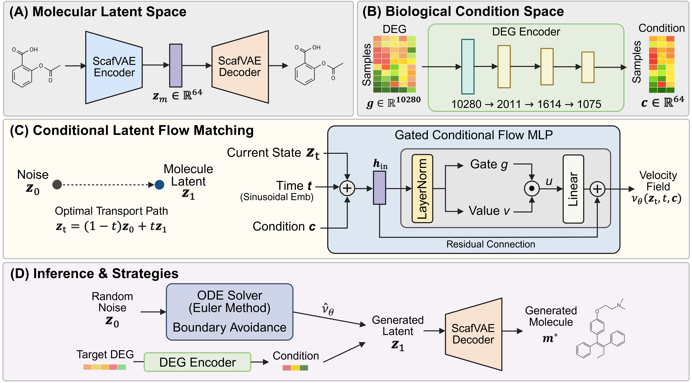

# DEG2MOL: Conditional Latent Flow Matching for Transcriptome-Guided De Novo Drug Design

## Abstract



Phenotypic drug discovery (PDD) has emerged as a promising paradigm for generating molecules conditioned on transcriptomic profiles to achieve desired biological activity, yet existing approaches suffer from training instability, high inference latency, and insufficient biological specificity in transcriptomic conditioning. To address these limitations, we propose DEG2MOL, the first conditional latent flow matching framework for PDD, which generates molecules by transforming Gaussian noise into molecular latent vectors guided by a Gene Ontology-informed differentially expressed gene (DEG) encoder. By conditioning on DEG profiles rather than post-treatment expression values and enforcing scaffold-aware data partitioning, DEG2MOL provides a more biologically grounded and methodologically rigorous framework for transcriptome-guided \textit{de novo} drug design. DEG2MOL achieved the top overall rank under both random and scaffold split settings, while delivering an inference time of 0.02 seconds per molecule, up to 11-fold faster than diffusion-based baselines. Molecular docking simulations confirmed that the generated molecules preserve critical binding interactions with target proteins, and cross-domain evaluation demonstrated consistent generalizability across knockdown, knockout, and single-cell Perturb-seq DEG profiles. Computational simulations of transcriptomic responses induced by the generated molecules showed high pathway-level correlations with experimental Perturb-seq profiles, with Spearman correlations ranging from 0.39 to 0.56. The data and code are available at \href{https://github.com/KU-MedAI/DEG2MOL}{https://github.com/KU-MedAI/DEG2MOL}.

## Environment Setting

### Required Packages

```bash
# PyTorch (CUDA support recommended)
pip install torch torchvision torchaudio

# Flow Matching and ODE Solver
pip install torchdiffeq

# Data Processing
pip install pandas numpy scipy

# Molecular Processing and Evaluation
pip install rdkit

# Progress Display
pip install tqdm

# Optional: Experiment Tracking
pip install wandb
```

## Data

### Data Format

The project uses the following data formats:

1. **DEG Data** (`.feather` format)
   - Columns: `cmap_name` (molecule identifier), gene names (12,014 genes)
   - File locations: `data/{data_type}/train.feather`, `data/{data_type}/valid.feather`
   - Example data types: `KO`, `KD`, `Perturb-seq`

2. **Gene Order File** (`.csv` format)
   - File that defines the standard order of gene names
   - Default path: `data/first_GO_matrix_cmap_12014x1574.csv`
   - Gene names stored as index

3. **Molecular Latent Representations** (`.npz` format)
   - Molecular latent representations encoded by ScafVAE
   - File location: `{task_path}/scaf/{cmap_name}.npz`
   - One `.npz` file per molecule

4. **Molecular Feature Data** (`.npz` format)
   - Additional feature information for molecules
   - File location: `{task_path}/feat/{cmap_name}.npz`

### Data Directory Structure

```
data/
├── {data_type}/
│   ├── train.feather      # Training DEG data
│   └── valid.feather      # Validation DEG data
```

### Pre-trained Models

- **DEG Encoder**: Model that encodes DEG data into latent space
  - Default path: `checkpoints/DEGMON_AE_Best_model.pth`
  - Supports Autoencoder types

- **ScafVAE**: Molecular encoding/decoding model
  - Automatically loaded from ScafVAE library

## Implementation

### 1. Training

Train the Flow Matching model.

```bash
python train.py \
    --use_ema \
    --use_amp \
    --use_scheduler \
    --save_dir ./checkpoints
```

#### Key Parameters

- `--combine_method`: Condition combination method (`sum`, `concat`, `cross_attn`)
- `--use_ema`: Whether to use Exponential Moving Average
- `--use_amp`: Whether to use Mixed Precision Training
- `--cfg_drop_prob`: Classifier-free guidance dropout probability (default: 0.3)

### 2. Testing

Generate molecules and evaluate using the trained model.

```bash
python test.py \
    --num_samples 100 \
    --guidance_scale 3 \
    --conditional
```

#### Key Parameters

- `--conditional`: Enable conditional generation mode
- `--num_samples`: Number of molecules to generate per test sample
- `--guidance_scale`: Classifier-free guidance scale

### 3. Inference

Generate molecules for new DEG data using the trained model.

```bash
python inference.py \
    --model_checkpoint ./checkpoints/DEG2MOL_best_model.pth \
    --data_type Perturb-seq \
    --num_samples 100 \
    --guidance_scale 3 \
```

#### Key Parameters

- `--data_type`: Data type (`KO`, `KD`, `Perturb-seq`)

### Output Files

- **Training**: Checkpoint files are saved in `--save_dir`
- **Testing/Inference**: Generated molecule dictionary is saved as a `.pkl` file
  - Filename: `{data_type}_generated_molecules_dict_{guidance_scale}.pkl`
  - Format: `{sample_name}_{idx}: {'generated_mols': [list of Mol objects]}`

### Model Architecture

#### Gated Conditional Flow MLP

- **Input**: Molecular latent representation `x`, time `t`, DEG condition `c`
- **Structure**: 
  - Time embedding (Sinusoidal)
  - Condition combination (sum/concat/cross-attention)
  - Gated MLP blocks
  - Output projection
- **Features**: Residual connections, Layer normalization, Dropout support

#### DEG Encoder

- **AE Mode**: `GO_Autoencoder` - Autoencoder-based encoder
  - Architecture: `[12014, 1574, 1386, 951, 515] → latent_dim`
